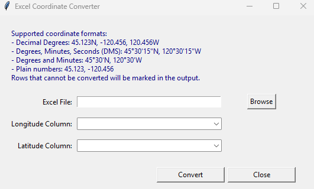

# Converta


Ever struggled with Excel files containing longitude and latitude values in every format imaginable? Converta is a user-friendly, minimal tool that effortlessly transforms mixed coordinate formats into decimal degrees, making your data instantly ready for mapping, analysis, or sharing.



## What Converta Does

- **Upload** your Excel file (.xlsx, .xls)
- **Autodetect** longitude and latitude columns (you can adjust if needed)
- **Convert** coordinates to decimal degrees
- **Output** a new Excel file with:
  - `Longitude_Converted`
  - `Latitude_Converted`
  - `Convert_Status` ("Yes" when both coordinates convert, "No" or "Skipped" when they do not)
- **Date-stamped** output filename for easy tracking
- **Skip** the first *n* rows in the web version when you want to ignore headers or notes
- **Modern UI** with clear instructions and a Close button

## Supported Coordinate Formats

Converta automatically handles:

- Decimal Degrees: `45.123N`, `-120.456`, `120.456W`
- Degrees, Minutes, Seconds (DMS): `45°30'15"N`, `120°30'15"W`
- Degrees and Minutes: `45°30'N`, `120°30'W`
- Plain numbers: `45.123`, `-120.456`

Rows that cannot be converted are marked with `Convert_Status = No`, and rows you skip are marked `Convert_Status = Skipped` in the output.

## Requirements

- Python 3.8 or newer
- pandas

## Setup

1. [Download Python](https://www.python.org/downloads/)
2. Open a command prompt and run:

   ```sh
   pip install pandas
   ```

## Adding Python to PATH

### Windows

1. During Python installation, check the box that says **Add Python to PATH**.
2. If Python is already installed:
   - Open **Control Panel > System > Advanced system settings > Environment Variables**.
   - Under **System variables**, find and select `Path`, then click **Edit**.
   - Click **New** and add the path to your Python installation (e.g., `C:\Users\YourName\AppData\Local\Programs\Python\Python38`).
   - Click **OK** to save.
   - Restart your command prompt.

### Linux

1. Open your terminal.
2. Add Python to your PATH by editing your shell profile (e.g., `.bashrc`, `.zshrc`):

   ```sh
   export PATH="$PATH:/usr/local/bin/python3"
   ```

3. Save the file and run:

   ```sh
   source ~/.bashrc
   ```

   (or the appropriate profile file for your shell)

4. Verify Python is on your PATH:

   ```sh
   python --version
   ```

## Web Version (GitHub Pages)

- Use Converta online at [ayiemba.github.io/Converta](https://ayiemba.github.io/Converta/).
- Choose your Excel file, pick the longitude and latitude columns, and optionally enter how many leading rows to skip.
- All parsing happens in your browser—no files are uploaded or stored anywhere.
- Download the converted workbook with date-stamped filename and the same `Convert_Status` columns as the desktop app.
- Link back to the source code is included on the page for easy forking and enhancements.

## How to Use Converta (Desktop)

1. Double-click `converta.bat` (included) or run:

   ```sh
   python main.py
   ```

2. In the app:
   - Click **Browse** to select your Excel file
   - Confirm or adjust the detected coordinate columns
   - Review the supported formats in the UI
   - Click **Convert**
   - Find your converted file in the same folder, with a date-stamped name
   - Click **Close** to exit

## License

MIT
